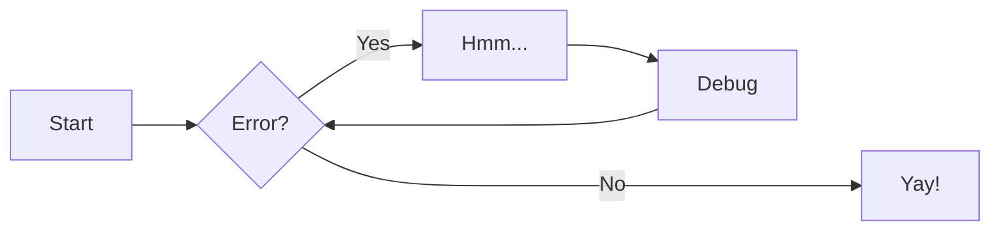

# Markdown Cheat Sheet 🏴‍☠

---

## Text

### Headings
```markdown
# Heading 1
## Heading 2
### Heading 3
#### Heading 4
##### Heading 5
###### heading 6
```

> # Heading 1
> ## Heading 2
> ### Heading 3
> #### Heading 4
> ##### Heading 5
> ###### heading 6


### Italics

```markdown
*This text* is italic.

_This text_ is italic.
```

> *This text* is italic.
> 
> _This text_ is italic.

### Strong

```markdown
**This text** is strong
__This text__ is italic
```
> **This text** is strong
>
>__This text__ is italic


### Strikethrough 
```markdown
~~This text~~ is strike through
```
> ~~This text~~ is strike through


### Horizontal Rule

```markdown
---
___
```

---
___


### Blockquote 
```markdown
> This is a quote
```
> This is a quote


### Links
```markdown
[Umun Tech](https://tech.umun.in)
```
> [Umun Tech](https://tech.umun.in)

### Links with title
```markdown
[Umun Tech](https://tech.umun.in "Title: Umun Tech")
```
> [Umun Tech](https://tech.umun.in "Title: Umun Tech")

### Links to files
```markdown
[My File](./file2.md)
```
> [My File](./file2.md)

### Unordered List
```markdown
* Item 1
* Item 2
* Item 3
    * Nested Item 1
    * Nested Item 2
        * Nexted item 3
```
>* Item 1
>* Item 2
>* Item 3
>    * Nested Item 1
>    * Nested Item 2
>        * Nexted item 3

### Ordered Lists
```markdown

1. Item 1
1. Item 2
1. Item 3
```

>1. Item 1
>1. Item 2
>1. Item 3

### Inline code block 
```markdown
<p>This is a paragraph code</p>
```
<p>This is a paragraph code</p>


### Images


## Github Markdown
Is a private flavor or markdown made by github

### Code Blocks
<!-- Code blocks -->


```bash
    npm install
    npm start
```

```javascript
    function add(num1, num2) {
    return num1 + num2;
}
```

```python
    def add(num1, num2):
        return num1 + num2
```

### Tables

```markdown
|Name|Email|
|---|----|
|John Dow| jon@gmail.com|
|Jim Cow| jim@gmail.com|
```

|Name|Email|
|---|----|
|John Dow| jon@gmail.com|
|Jim Cow| jim@gmail.com|

### Task Lists
```markdown
* [x] Task 1
* [x] Task 2
* [ ] Task 3
```

* [x] Task 1
* [x] Task 2
* [ ] Task 3


### Flowcharts

```markdown
    ``` mermaid
    graph LR
      A[Start] --> B{Error?};
      B -->|Yes| C[Hmm...];
      C --> D[Debug];
      D --> B;
      B ---->|No| E[Yay!];
    ```
```



